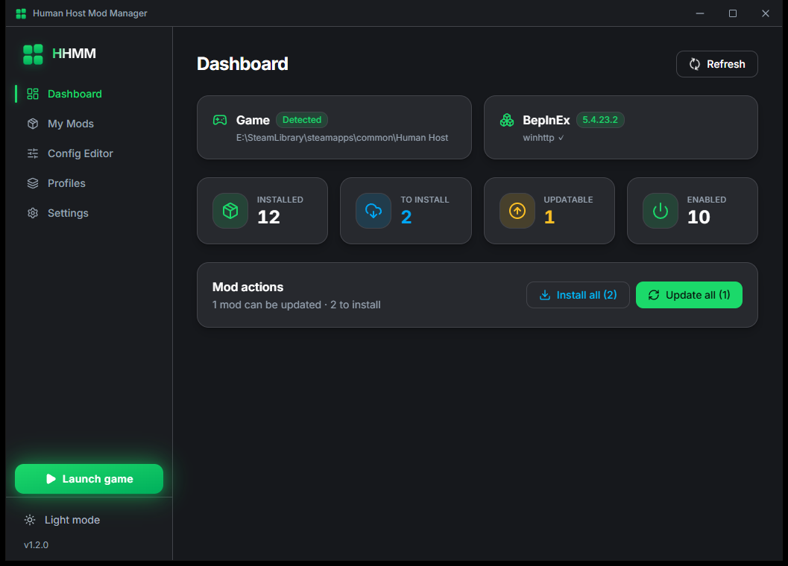
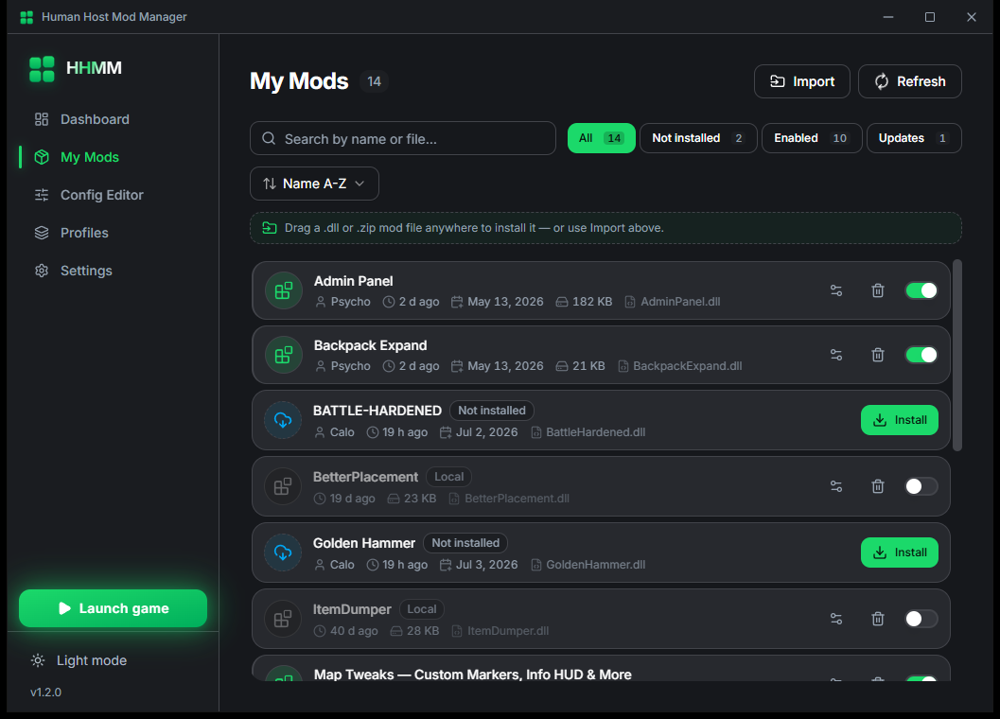
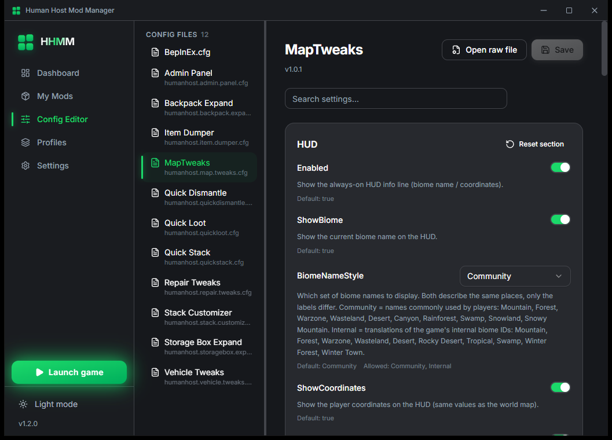
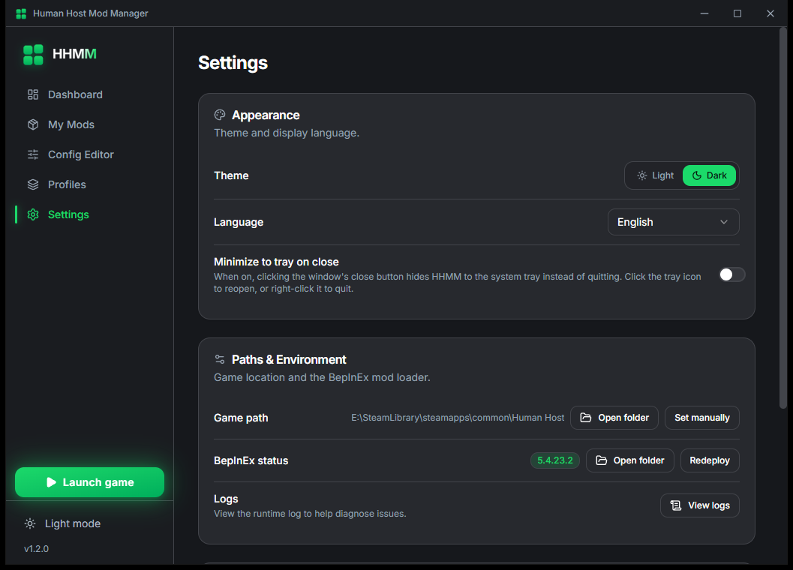

<div align="center">


# HHMM — Human Host Mod Manager

**A lightweight Windows desktop app that makes managing your [Human Host](https://store.steampowered.com/app/2393970/) mods effortless — sync, enable, configure, and back up your whole setup, all in one clean window.**

[](https://github.com/xem888/HHMM/releases/latest)
[](https://github.com/xem888/HHMM/releases)
[](LICENSE)
[](#download--install)
[](https://tauri.app)

</div>

No more digging through folders or hand-editing config files. HHMM does the boring "last mile" for you while Steam keeps handling the mod downloads and updates.



## Features

- **Install & update from your subscriptions** — per mod or all at once, as the mod's whole file tree (sub-folders, assets and extra dlls included), at exactly the same paths the game's own in-game Mod Browser uses, so the two tools always agree on what is installed
- **Enable / disable per mod** — turn any mod on or off individually, no file juggling; the whole mod moves, nothing is left behind in `plugins`
- **Visual config editor** — tweak every mod's settings with real controls (sliders, toggles, key-capture), no manual text editing; built-in safety so you can't break the file format
- **Open raw config** — advanced users can still open the original `.cfg` in one click
- **One-click BepInEx** — install / deploy the mod framework automatically (download integrity verified via SHA-256), with the game's required `HideManagerGameObject` setting enabled out of the box
- **Required-setting guard** — if that setting is ever off (hand-installed BepInEx, old profiles, manual edits), the dashboard warns you and fixes it in one click — no more "mods installed but nothing happens in game"
- **Config profiles** — snapshot your entire mod setup (which mods are on + all their settings) and switch between setups with one click
- **Drag & drop install** — drop a local `.dll` or `.zip` anywhere in the window to install it; zips keep their folder structure
- **Workshop titles & authors** — shows real mod names and authors, not cryptic file names
- **Mod-shipped config translations** — mod authors can bundle a `<DllName>.hhmm-i18n.json` next to their dll to ship translated setting names and descriptions with the mod itself; HHMM also carries built-in translations for popular mods
- **14 languages**, light / dark theme, system tray support, automatic self-update

## Screenshots

| My Mods | Config Editor |
|---|---|
|  |  |

| Profiles | Settings |
|---|---|
|  |  |

## Download & Install

- **Steam Workshop (recommended)**: [Subscribe to the Workshop item](https://steamcommunity.com/sharedfiles/filedetails/?id=3740140784), then run `HHMM_<version>_x64-setup.exe` from `<Your Steam>\steamapps\workshop\content\2393970\3740140784\`
- **GitHub**: grab the latest `*-setup.exe` from [Releases](https://github.com/xem888/HHMM/releases/latest)

**System requirements**: Windows 10/11 x64, [WebView2 runtime](https://developer.microsoft.com/microsoft-edge/webview2/) (preinstalled on Windows 11 and most Windows 10 systems).

## FAQ

### Windows SmartScreen warns about an unknown publisher

The installer is not Authenticode-signed (signing certificates are expensive for a free community tool). Click "More info" → "Run anyway". Auto-updates are protected separately by minisign signatures.

### My antivirus flags HHMM as a trojan

A few heuristic engines (notably Kaspersky-based ones) flag the installer as `HEUR:Trojan-Downloader.Win32.Convagent.gen`. This is a **false positive**: the detection is a generic heuristic that fires on the combination "unsigned installer + program that downloads executables" — and HHMM legitimately downloads files (it fetches BepInEx for you and checks for its own updates). On VirusTotal, 65 of 68 engines — including Microsoft Defender, Bitdefender and ESET — pass the exact release build clean, and the sandbox execution scores clean as well.

This repository exists so you don't have to take anyone's word for it: **the full source code is right here.** Every network request the app makes lives in plain sight — BepInEx deployment in [`src-tauri/src/bepinex/`](src-tauri/src/bepinex/), self-update via Tauri's official updater plugin with minisign signature verification. Audit it, build it yourself, and compare behavior.

### "Game not found" on first launch

HHMM auto-detects the game via the Steam registry. If your game lives in a non-standard location, use **Settings → Set manually** to point HHMM at the game folder.

### Mod authors not showing

Author names come from `steamcommunity.com`, which may be unreachable in some regions. Mod titles still work; the author column degrades gracefully.

## Building from source

Prerequisites: [Node.js](https://nodejs.org) 20+, [Rust](https://rustup.rs) (stable, MSVC toolchain), and the [Tauri 2 Windows prerequisites](https://tauri.app/start/prerequisites/).

```sh
npm install          # frontend deps
npm run tauri dev    # run in dev mode (hot reload)
npm run tauri build  # production build (NSIS installer)
```

Quality checks:

```sh
npx tsc --noEmit             # TypeScript type check
npm run check:i18n           # i18n key completeness (14 languages × 7 namespaces)
cd src-tauri && cargo test   # Rust unit tests
```

> **Release tags:** the source was published on 2026-07-04, after v1.0.0 - v1.2.0 had already been released, so those three tags do not point at the code they were built from. From v1.3.0 on, every release tag points at the exact source of that build.

## Architecture

Tech stack: **Tauri 2** (Rust backend) + **React 19** + TypeScript + Vite + Tailwind CSS 4 + zustand + framer-motion.

```
src/                 # React frontend (pages, components, stores, i18n)
src-tauri/src/       # Rust backend
  commands/          #   thin IPC layer (#[tauri::command])
  bepinex/ cfg/ mods/ profile/ steam/ install/   # domain modules
  fsx.rs paths.rs error.rs state.rs              # infrastructure
```

Design notes:

- HHMM is a **manager tool** — it organizes mods for Human Host (via BepInEx). It does **not** modify or alter the game itself.
- Your subscribed mods, saves, and configs stay yours — HHMM only moves/toggles mod files and edits their config values, with backups along the way.
- Config writes are surgical: the editor rewrites only the changed values and keeps the rest of the file byte-identical (round-trip tested for both LF and CRLF).

## License

[MIT](LICENSE) © 2026 xem888
